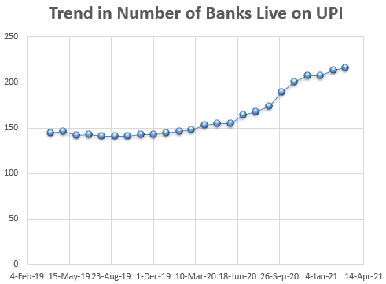
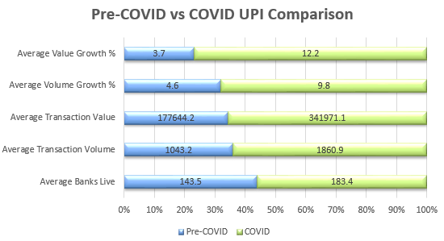

# Impact of COVID-19 on UPI Digital Payment Behavior in India

A research-based analytical study evaluating how the COVID-19 pandemic altered digital payment adoption and transactional behavior in India. This project leverages historical Unified Payments Interface (UPI) transaction data, comparative growth calculations, and statistical trend analysis derived directly from National Payments Corporation of India (NPCI) statistics.

---

## Objective
To analyze macro-level shifts in digital payment volumes and values during pre-pandemic, mid-pandemic, and post-lockdown horizons, highlighting the acceleration of contactless financial ecosystems.

## Methodologies & Analysis Performed
* **Comparative Analysis:** Point-in-time growth percentage metrics evaluating transaction scaling.
* **Graphical Trend Analysis:** Time-series mapping of macro transactional behaviors across economic quarters.
* **Volume vs. Value Trajectories:** Differentiating velocity growth (transaction count) from deep monetary value distribution.

---

## Trend Analysis & Data Visualizations

### Transaction Volume & Monetary Value Trajectories
The plots below show the compounding growth curves across transaction counts and value metrics over the observed timelines:

| Historical Volume Progression | Aggregate Value Trajectory |
| :---: | :---: |
|  |  |

### Macro Integration Trends
Below are the underlying institutional distributions and shifts between pre-pandemic baselines and pandemic inflection points:

| Banking Integration Metrics | Pre-COVID vs. COVID Behavior Pivot |
| :---: | :---: |
|  |  |

---

## Project Repository Structure
* `UPI monthly transaction data.xlsx` — Aggregated time-series data cleared from official NPCI source publications.
* `Report_Upi.pdf` — Complete formal analytical research paper documenting methodologies, growth formulas, and policy implications.
